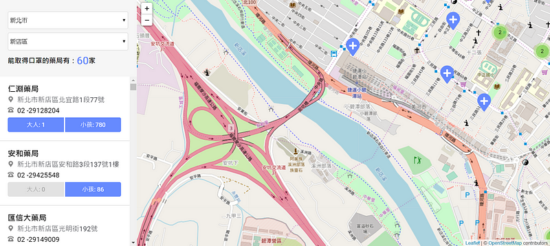
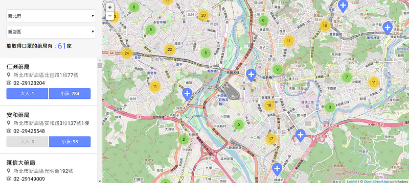

在台灣口罩實名制啟動後  
看到許多前端的大神們紛紛運用自己技術，創造出一個個口罩地圖  
不論是網站、APP 或是 LINE 機器人，方便民眾們查詢購買

這次想來跟風一下，順便挑戰沒接觸過的地圖 API  
文章主要紀錄學習跟使用到的 JS，不會談論太多切版

 

>作品 DEMO：
https://jasmin0410.github.io/mask-map/
CODE：
https://github.com/Jasmin0410/mask-map
UI 版型：
https://challenge.thef2e.com/user/3?schedule=4427#works-4427
感謝參加 F2E 活動的設計師們 👏👏

 

# 頁面介紹

## 左－藥局列表
上方選擇縣市與行政區後，下方會渲覽該區有存貨的藥局  
點選藥局資訊，右方地圖會移至該藥局座標且顯示資訊 popup

## 右－地圖
地圖上顯示藥局的 marker，點選即會跳出該藥局資訊：地址、電話、口罩存貨狀態

 

# 串接API

> API : [藥局+衛生所即時庫存](https://raw.githubusercontent.com/kiang/pharmacies/master/json/points.json?fbclid=IwAR0oowBRjj1goAMqtnugBiXMTMY8OCl14TGmgt3YDJi9w5BXs4VsfZQ9mDI)

 

# 縣市選單
在 github 上找到有人整理的 — [台灣 縣市，鄉鎮，地址 中英文 JSON](https://github.com/donma/TaiwanAddressCityAreaRoadChineseEnglishJSON)，就直接下載 JSON 檔來使用囉

## UI 

## JS
讓使用者選擇完縣市後，再依據縣市去 render 該縣市行政區

 

# 新增地圖
地圖使用到的框架 — [Leaflet](https://leafletjs.com/)，圖資為 OpenStreetMap

在 componentDidMount 載入地圖
加入地圖的同時，也必須設定**中心點(center)**跟**縮放程度(zoom)**

 

# 加入資料跟座標

為避免效能問題會引入套件 [**leaflet.markercluster**](https://github.com/Leaflet/Leaflet.markercluster)
讓鄰近的 marker 以群組管理，需要查看時在縮放展開群組中的藥局

接下來，就來引入資料跟新增Marker  
新增 Marker 同時使用 `.bindPopup()` ，來加上藥局資訊的 popup

 

# 地圖中心更改

雖然一開始將地圖設定了預設縣市跟行政區  
但其他人使用時總不可能永遠新北市跟新店區吧！  
所以在切換縣市時，預設將取該區域的**第一筆**藥局資訊

在縣市選擇清單加上 `getCenter()` 把座標值存入 redux 中

當 props 改變時，藉由 `componentDidUpdate()` 來移動地圖中心

 

# 地圖中心移至藥局

MaskMap.js 加上了修改座標的功能  
當然，在藥局選單中的每個藥局也要加上修改座標的 function 拉！

 

以上就是我的口罩地圖製作筆記  
也希望這波疫情快快過去，大家都身體健康、平平安安

有任何建議也歡迎底下留言指教 😃  
或是點點拍手鼓勵一下小妹我吧！👏👏

 
 
# 參考資料

*   Youtube 影片：[Leaflet + OpenStreetMap 地圖應用開發](https://www.youtube.com/watch?v=pUizu62dlnY)
*   [Leaflet + OpenStreetMap (OSM) 特訓班](https://quip.com/vdqYAiFHHkaV)
*   [Leaflet筆記](https://hackmd.io/@Eotones/SkOdJH4s4?type=view)